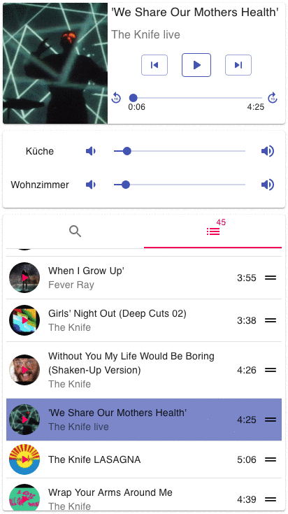
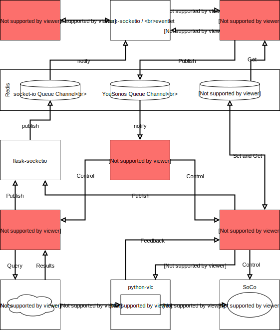

# YouSonos
Play YouTube audio streams on the Sonos loudspeakers in your local network.

<p align="center">
    
</p>

YouSonos is a streaming server that runs on a computer in your local network.
It can fetch YouTube audio streams and feed them to Sonos loudspeakers.
YouSonos is also a web server that serves a web app to clients in your local network.
With this web app you control the streaming server: you can search for tracks on YouTube and tell the server what to play.

## Running YouSonos in Your Home
There are two approaches to set up YouSonos in your home: use [Docker](https://docs.docker.com/) (recommended) or 
install manually.

Regardless of which approach you choose, the following prerequisites apply:
* The firmware version of the Sonos system needs to be 10.1 or later.
* If you want to be able to search tracks by keywords (artist name, track title, etc.) you need a valid **YouTube API key**.
You can obtain this key from the [Google developer console](https://console.developers.google.com/) (an ordinary Google 
login should be sufficient for access). **If you don't specify a YouTube API key on server start-up, the keyword search 
feature will be disabled and only YouTube URLs, YouTube video ids, or YouTube playlist ids are valid search input.**

### Docker Setup
(only tested for Raspbian)

Prerequisites: Docker and docker-compose need to be installed.

0. Clone this repo and `cd` into it.

0. Build the docker image (this takes a while):
    ```
    docker-compose build
    ```
0. *(Optional)* Add a valid YouTube API key by fixing the following line in the file `docker-compose.yml`:
    ```
    command: ["--host", "0.0.0.0", "--port", "80", "--youtube-api-key", "<specify-your-YouTube-API-key-here>"]
    ```
0. Start the YouSonos web server:
    ```
    docker-compose up
    ```
0. Now you should see the YouSonos client app when browsing to http://localhost:80.

### Manual Setup
(only tested for macOS)

Prerequisites: python 3.7, [pipenv](https://docs.pipenv.org), [npm](https://www.npmjs.com/get-npm), and 
[VLC player](https://www.videolan.org/vlc/) need to be installed.

0. Download, build and run Redis according to the [Redis Quick Start manual](https://redis.io/topics/quickstart) (requires `make`).

0. Clone this repo and `cd` into it.

0. Install all python dependencies with `pipenv`:
    ```
    pipenv install
    ```
0. Install all javascript dependencies with `npm` (I guess using `yarn` would work too):
    ```
    npm install
    ```
0. Build the React web app with `npm`:
    ```
    npm run build
    ```
0. Start the YouSonos web server by using `pipenv` (you could also first start a `pipenv shell` and then start the server
 with `python youSonos.py`):
    ```
    pipenv run python youSonos.py -v --youtube-api-key <your-YouTube-API-key-goes-here-if-you-own-one>
    ```
0. Browse to http://127.0.0.1:5000 to see the YouSonos client app.
Consider passing appropriate options to the server with `--host` (i.e. `0.0.0.0`) and `--port`.

## Setup on Raspberry Pi together with DNS Server
At my home YouSonos runs in a Docker container on a Raspberry Pi 3 Model B+. To setup Docker on the Pi (running Raspbian),
 I followed the 
[official instruction](https://docs.docker.com/install/linux/docker-ce/debian/#install-using-the-convenience-script) 
which boils down to:
```
curl -fsSL https://get.docker.com -o get-docker.sh
sudo sh get-docker.sh
sudo usermod -aG docker pi
```
Now you can setup YouSonos on your Pi by following the steps under [Docker Setup](README.md). Afterwards you can access 
YouSonos from any device in your local network by browsing to the IP of your Pi.

However, the necessity to remember the IP of the Pi is inconvenient. Therefore, I also setup a local DNS server so that
YouSonos is accessible from any device in the local network by browsing to http://yousonos.local. The DNS server
runs also in a Docker container on the same host as the YouSonos container (i.e. the Pi). For the DNS server setup I 
followed essentially the instructions given in the blog post 
[Running CoreDNS as a DNS Server in a Container](https://dev.to/robbmanes/running-coredns-as-a-dns-server-in-a-container-1d0).
I ended up with the following `Corefile`:
```
.:53 {
    forward . 8.8.8.8 9.9.9.9
    log
    errors
}

local:53 {
    file /root/local.db
    log
    errors
}
```

... and the following `local.db` file:
```
local.               IN  SOA dns.local. fachri.local. 2019051215 7200 3600 1209600 3600
router.local.        IN  A   192.168.2.1
dns.local.           IN  A   192.168.2.132
pi.local.            IN  A   192.168.2.132
yousonos.local.      IN  A   192.168.2.132
```
I started the CoreDNS container with the following command. There are two differences to the command from the blog post:
different image `coredns/coredns:coredns-arm` and additional option `--network=host`.
```
docker run -d --name dns_server --restart=always --network=host --volume=/home/pi/containers/coredns/:/root/ coredns/coredns:coredns-arm -conf /root/Corefile
```
Furthermore I had to alter the config of my network router to ..
* ... make sure the router assigns always the same IP (`192.168.2.132`) to the Pi (based on the MAC address of the active 
network interface of the Pi).
* ... tell the router to use the IP of the Pi as the only DNS server.

## Implementation

<p align="center">
    
</p>

YouSonos has a traditional client-server architecture using WebSocket as communication protocol. 
The [front end](client) is a single page web app written in TypeScript with [React](https://facebook.github.io/create-react-app/)
and [material-ui](https://material-ui.com/). For the client side WebSocket event handling the 
[SocketIO client library](https://github.com/socketio/socket.io-client) is used. 
The back end is written in Python and consists roughly of the following components:
* [YouSonos server](server): 
    * Uses [flask-socketIO](https://flask-socketio.readthedocs.io/en/latest/) for WebSocket event processing.
    * Defines the events that the client can send to the server.
    * Forwards received events to the appropriate Redis message queue.
    * Provides initial data (e.g. available Sonos speakers, playlist, 
    track currently played, etc.) to a newly connected client.
    * Initial data are loaded from Redis.
    
* [YouSonos event consumers](player/EventConsumer.py):
    * Two event consumer instances exist: one for player state change events and one for search events.
    * They subscribe and listen on dedicated Redis message queues.
    * They forward messages either to the YouSonos player or the YouSonos search service.
    * Each consumer has its own event loop.
    * Read events one-by-one.
    * Ensures that messages are executed in the order received by the server. This is especially imported for player state 
    change events since we want to prevent that the execution of an event is interrupted intermediately. If, for example, 
    one client sends a 'play next' event and an other client sends a 'stop' event, we want to make sure that 'play next' is
    completed before the player state is altered again due to the 'stop' event.
    
* [YouSonos player](player):
    * Receives player state change events (start playing, stop playing, add to playlist, etc.) from the YouSonos player 
    event consumer.
    * Publishes player state chang events to flask-socketIO, which are subsequently forwarded to all clients.
    * Reads and writes key-value pairs to / from Redis (e.g. the playlist).
    * Loads meta data from YouTube (title, artist, cover image, duration, etc.) using [pafy](https://pypi.org/project/pafy/) 
    and [youtube-dl](https://ytdl-org.github.io/youtube-dl/index.html).
    * Determines the actual stream URL from a YouTube id.
    * Instructs libVLC to setup or tear down a stream.
    * Manages the playlist.
    * Controls the Sonos system, i.e. tells Sonos the URL of the stream to play (outgoing stream from server to Sonos).

* [YouSonos search service](player/SearchService.py):
    * Receives search events from the YouSonos player event consumer.
    * Publishes search result events to flask-socketIO, which are subsequently forwarded to the client that initiated the search.
    * Resolves the stream URL and track meta data for YouTube URLs, YouTube track ids, and YouTube playlist with 
    [pafy](https://pypi.org/project/pafy/) and [youtube-dl](https://ytdl-org.github.io/youtube-dl/index.html).
    * Uses the [Google YouTube API](https://developers.google.com/youtube/v3/getting-started) for searching for tracks 
    based on keywords.
* [libVLC](https://www.videolan.org/vlc/libvlc.html) (the library backing the VLC player)
    * Is used for the actual audio stream processing. 
    * Reads a stream from YouTube, transforms it and sends it to the Sonos speakers over http. 
    * YouSonos registers callbacks in libVLC to receive updates on track progress and end. 
    * The parameters passed to VLC to setup the audio stream from the server to the Sonos speakers can be controlled by 
the command line option `--vlc-command`. The default command is:
        ```
        :sout=#transcode{acodec=mp3,ab=192}:standard{mux=raw,dst=/yousonos.mp3,access=http,sap}
        ```
    * libVLC is accessed from Python through the [python bindings](https://wiki.videolan.org/Python_bindings/) provided 
    by videoLAN.

* Sonos system:
    * The [SoCo library](http://python-soco.com/) is used for the interaction with the Sonos system.
    * At server startup the available speakers and the system coordinators are detected.
    * Allows to set individual volume levels for each detected speaker.
* [Redis](https://redis.io/) database and message queue:
    * YouSonos persists data that must survive a server restart as key-value pairs to Redis (i.e. the playlist).
    * YouSonos creates two flask-socketIO server instances in two separate processes.
    These server instances communicate through a Redis message queue.
    The two flask-socketIO server instances in separate processes are required because YouSonos applies two different 
    parallelism paradigms.
    YouSonos player and YouSonos search service use common Python threads, but YouSonos server is 
    based on [eventlet](https://eventlet.net/) which uses coroutines to enable non-blocking I/O.
    * Sequences client events received by the YouSonos server and forwards them to the YouSonos player or YouSonos
    search service via the YouSonos event consumers.


## Known Issues
* Fails on start up if Sonos system is split up in multiple zones (multiple coordinators).
* ~~Tracks can't be played after they have been contained in the playlist for a long time (YouTube stream URL expires).~~ 
Fixed with 8b18f994b2a9cdab86d8293317b5872049f87970 .
* The last few seconds of a track are skipped.
* Some YouTube tracks refuse to play. Examples needed.

## Ideas for Future Work

* Faster keyword search.
* Better feedback in GUI after user input, e.g. on add to playlist or play/pause.
* Send feedback to all connected clients at start of player state transition. E.g. if a user starts to seek, 
seek should be disabled for all other users until seek completed.
* Display search results in coverflow style as shown in [this demo](https://react-swipeable-views.com/demos/demos/#coverflow).
* Support for youtube mixes.
* Support for 'add to home screen' in ~~iOS~~ (3742424180560db809ca943bbcd94f934411990a) and Android.
* Support for additional input sources beside YouTube.
* Support for other stream consumers beside Sonos.
* Adding some tests would be nice.

## License
[GNU General Public License v3.0](LICENSE.txt)
